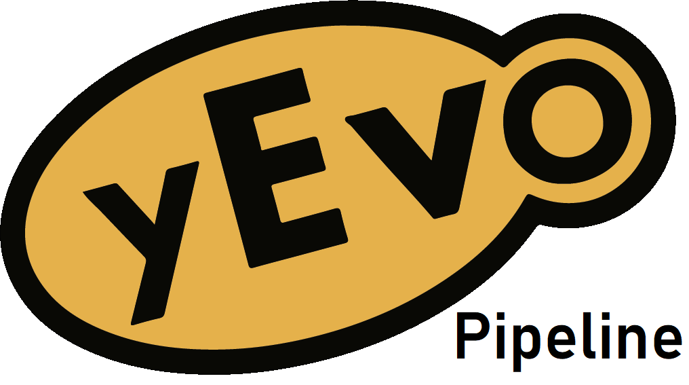

<div align="center">
    <a href="#readme"></a>
</div>


# yEvo Pipeline

[](https://snakemake.readthedocs.io)
[](https://docs.conda.io/en/latest/miniconda.html)

Variant calling Snakemake pipeline for analyzing [yEvo](https://yevo.org/) sequencing data.


## Installation

1. Make sure you have [conda](https://docs.conda.io/en/latest/miniconda.html) installed. 

2. Install Mamba to facilitate snakemake installation, as recommended in the [Snakemake docs](https://snakemake.readthedocs.io/en/stable/getting_started/installation.html#installation-via-conda-mamba).

```
$ conda install -n base -c conda-forge mamba
```

3. Clone this repo:

```
$ git clone https://github.com/dunhamlab/yevo_pipeline.git
```

4. Create the provided [environment](./environment.yml) using Mamba:

```
$ cd yevo_pipeline/ && mamba env create -f environment.yml
```

5. Activate the new conda environment:

```
$ conda activate yevo_pipeline_env
```

6. Download the required pipeline inputs and test sequencing data:

```
$ ./scripts/download_test_data.sh
```

7. Generate the `run_pipeline.sh` script using the included utility script:

```
$ ./scripts/gen_run_script.sh
```

You're ready to run the pipeline!


## Running the Pipeline

After following the above installation instructions, run the pipeline on the provided test input files:

```
$ ./run_pipeline.sh
```

**NOTE:** be sure that you are in the repo's base directory with the `yevo_pipeline_env` conda environment activated.

To run this pipeline on your own sequencing data, configure runs using `run_pipeline.sh`:

* `FASTQ_DIR` is the absolute path to the raw data (e.g. fastq.gz) directory
* `OUTPUT_DIR` is the absolute path to your desired output directory, which Snakemake will create

Reference genome, ancestor, and annotation file paths are located in the [config/config.yml](config/config.yml) file and can also be modified as needed.
